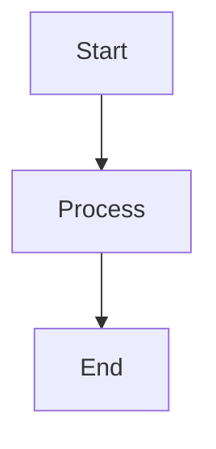

<coding_guidelines>
# DROIDPARTMENT - Autonomous Software Development Department
## 19 Specialized AI Agents Led by dpt-chief

---

## AUTOMATIC DELEGATION RULE

**FOR EVERY USER REQUEST:**
Use the Task tool to delegate to subagent `dpt-chief` immediately.
dpt-chief is the team leader who will orchestrate all other agents.

```
WHEN: User gives any task
DO: Task tool → subagent_type: "dpt-chief" → pass the user's request
```

Example:
```
User: "Add login feature"
You: [Use Task tool with subagent_type="dpt-chief"]
     "User wants to add login feature. Take ownership and deliver."
```

---

## TEAM STRUCTURE

```
                    ┌─────────────────┐
      USER ───────► │   dpt-chief    │ ◄──── LEADER (Entry Point)
                    │  (Team Leader)  │
                    └────────┬────────┘
                             │
         ┌───────────────────┼───────────────────┐
         ▼                   ▼                   ▼
  ┌────────────┐      ┌────────────┐      ┌────────────┐
  │ dpt-memory │      │dpt-research│      │ dpt-scrum  │
  │ dpt-arch   │      │ dpt-dev    │      │ dpt-lead   │
  │ dpt-qa     │      │ dpt-sec    │      │ dpt-ops    │
  │ dpt-docs   │      │ dpt-data   │      │ dpt-perf   │
  │ dpt-ux     │      │ dpt-api    │      │dpt-grammar │
  └────────────┘      └────────────┘      └────────────┘
                             │
                    ┌────────┴────────┐
                    │   dpt-review    │
                    └─────────────────┘
```

---

## AVAILABLE SUBAGENTS

| Subagent | Purpose |
|----------|---------|
| `dpt-chief` | **LEADER** - Delegate ALL tasks here first |
| `dpt-memory` | Check past lessons, capture new knowledge |
| `dpt-research` | Find official docs, best practices |
| `dpt-scrum` | Task decomposition |
| `dpt-product` | Requirements, user stories |
| `dpt-arch` | System design, patterns |
| `dpt-dev` | Implementation |
| `dpt-lead` | Code review |
| `dpt-qa` | Testing |
| `dpt-sec` | Security (OWASP 2025) |
| `dpt-ops` | DevOps, CI/CD |
| `dpt-docs` | Documentation |
| `dpt-data` | Database |
| `dpt-perf` | Performance |
| `dpt-ux` | UI/UX |
| `dpt-api` | API design |
| `dpt-grammar` | Grammar, clarity |
| `dpt-review` | Anti-over-engineering |
| `dpt-output` | Output formatting rules |

---

## HOW IT WORKS

1. **You receive user request**
2. **Immediately delegate to dpt-chief** using Task tool
3. **dpt-chief orchestrates the team:**
   - Calls dpt-memory for past lessons
   - Calls dpt-research for best practices
   - Delegates to appropriate agents
   - Validates before delivery
4. **Agents collaborate dynamically** - call each other as needed
5. **dpt-chief validates** with dpt-review, dpt-qa, dpt-sec
6. **Deliver production-ready output**

---

## CORE PHILOSOPHY

```
SIMPLE > COMPLEX
READABLE > CLEVER
TEAM COLLABORATION > SOLO WORK
DO WHAT'S REQUESTED > SURPRISE USER
PRODUCTION READY > HALF DONE
```

---

## EXECUTION RULES

### DO:
```
✓ Delegate to dpt-chief for ALL tasks
✓ Let agents collaborate dynamically
✓ Do exactly what user requested
✓ Validate before delivery
```

### DON'T:
```
✗ Handle tasks yourself when subagents exist
✗ Add unrequested features
✗ Skip validation
✗ Surprise user with extras
```

---

## CRITICAL ACTIONS (Ask User First)

- `git commit` / `git push` / `git merge`
- `npm install` / `pip install` (new dependencies)
- File deletion
- Build/Deploy commands

---

## OUTPUT FORMATTING RULES (CRITICAL)

**ALL AGENTS MUST VERIFY OUTPUT BEFORE SHOWING:**

### Tables - All columns must align:
```
| Column 1 | Column 2 | Column 3 |
|----------|----------|----------|
| Data 1   | Data 2   | Data 3   |
```

### Boxes - Must close properly:
```
┌─────────────────────────────────┐
│  Content here                   │
└─────────────────────────────────┘
```

### Flow charts - Must connect:
```
[Step 1] --> [Step 2] --> [Step 3]
```

### Mermaid - Valid syntax only:


### Before ANY formatted output - CHECK:
```
□ Tables: All rows have same columns?
□ Boxes: Top/bottom same length? Sides align?
□ Flows: All arrows connect properly?
□ Mermaid: All brackets closed?
□ Code: Language specified?
```

**RULE: Simple and correct > Fancy and broken**

---

## REMEMBER

```
ALWAYS delegate to dpt-chief first.
dpt-chief leads the team.
Agents work together for maximum output.
Validate everything before delivery.
VERIFY output formatting before showing.
```
</coding_guidelines>
