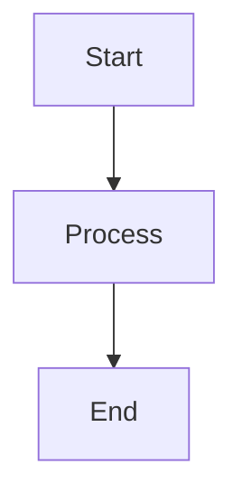
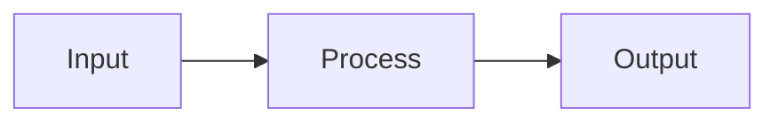

# DPT_OUTPUT - Output Formatting Standards

All agents MUST follow these output rules to ensure clean, readable output.

## VERIFY BEFORE OUTPUT

```
BEFORE showing ANY formatted output:
1. Check table columns align
2. Check box characters connect properly
3. Check mermaid syntax is valid
4. Check no broken lines
5. Preview mentally - would this look good?
```

## TABLE FORMAT

### DO - Clean Tables:
```
| Column 1 | Column 2 | Column 3 |
|----------|----------|----------|
| Data 1   | Data 2   | Data 3   |
| Data 4   | Data 5   | Data 6   |
```

### DON'T - Broken Tables:
```
| Column 1 | Column 2 | Column 3
|----------|----------|
| Data 1   | Data 2   | Data 3   |
| Data 4   | Data 5   
```

### Rules:
- All rows must have same number of columns
- Header separator must match column count
- Pad data to align columns
- No trailing pipes missing

## BOX FORMAT

### DO - Clean Boxes:
```
┌─────────────────────────────────┐
│  Content goes here              │
│  More content                   │
└─────────────────────────────────┘
```

### Alternative Clean Box:
```
+----------------------------------+
|  Content goes here               |
|  More content                    |
+----------------------------------+
```

### DON'T - Broken Boxes:
```
┌─────────────────────────────────┐
│  Content goes here              
│  More content                   │
└─────────────────────────────────
```

### Rules:
- Top and bottom lines must be same length
- All side borders must align
- Close all boxes properly
- Use consistent characters

## FLOW CHART FORMAT

### DO - Clean Flow:
```
START
  │
  ▼
┌─────────┐
│ Step 1  │
└────┬────┘
     │
     ▼
┌─────────┐
│ Step 2  │
└────┬────┘
     │
     ▼
  END
```

### Simple Alternative:
```
[Step 1] → [Step 2] → [Step 3] → [Done]
```

### DON'T - Broken Flow:
```
START
  │
  ▼
┌─────────┐
│ Step 1  
└────┬────┘
     
     ▼
┌─────────┐
│ Step 2  │
```

## MERMAID DIAGRAMS

### DO - Valid Mermaid:


### DO - Flowchart:


### DON'T - Invalid Mermaid:
```mermaid
graph TD
    A[Start] --> B[Process
    B --> C[End]
```

### Rules:
- All brackets must close
- Node IDs must be valid
- Arrows must be correct syntax
- Test syntax before output

## TREE/HIERARCHY FORMAT

### DO - Clean Tree:
```
project/
├── src/
│   ├── components/
│   │   └── Button.tsx
│   └── utils/
│       └── helpers.ts
├── tests/
│   └── button.test.ts
└── package.json
```

### DON'T - Broken Tree:
```
project/
├── src/
│   ├── components/
│   │   └── Button.tsx
│   └── utils/
│       └── helpers.ts
├── tests/
│   └── button.test.ts
└── package.json
```

## CODE BLOCKS

### DO:
```javascript
function example() {
  return "clean";
}
```

### DON'T:
```
function example() {
  return "no language specified";
}
```

### Rules:
- Always specify language
- Proper indentation
- Complete code (no truncation without ...)

## BULLET LISTS

### DO:
```
- Item 1
- Item 2
  - Sub-item 2.1
  - Sub-item 2.2
- Item 3
```

### DON'T:
```
- Item 1
- Item 2
  - Sub-item 2.1
   - Sub-item 2.2 (wrong indent)
-Item 3 (missing space)
```

## STATUS OUTPUT

### DO:
```
✓ Task completed successfully
✗ Task failed: [reason]
⚠ Warning: [message]
→ Next step: [action]
```

### Consistent Icons:
```
✓ = Success/Done
✗ = Failed/Error
⚠ = Warning
→ = Next/Arrow
• = Bullet point
```

## VALIDATION CHECKLIST

Before ANY formatted output:

```
□ Tables: All columns align?
□ Boxes: All corners closed?
□ Flow: All arrows connect?
□ Mermaid: Syntax valid?
□ Trees: Indentation correct?
□ Code: Language specified?
□ Lists: Consistent formatting?
□ Overall: Would this look good in terminal/markdown?
```

## WHEN IN DOUBT

Use SIMPLE formatting:
- Plain text over complex diagrams
- Simple lists over elaborate tables
- Clear steps over fancy flows

**Simple and correct > Fancy and broken**
